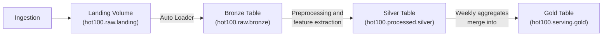

## What are we Singing About? (Databricks edition)

This is a new implementation of [a previous project](https://github.com/joelb856/what-are-we-singing-about) to ingest, process, and serve an analysis of the lyics and metadata associated with the [weekly Billboard Hot 100 songs](https://www.billboard.com/charts/hot-100/) using Databricks Free Edition.

Each Tuesday the pipeline:
1. Ingests [the latest Hot 100 songs](https://raw.githubusercontent.com/mhollingshead/billboard-hot-100/main/recent.json), including [lyrics](https://lyrist.vercel.app/guide) and [metadata](https://www.last.fm/api)
2. Extracts features (language, word count, [affect frequencies](https://pypi.org/project/NRCLex/))
3. Upserts aggregated metrics into a serving table
---

## Architecture



---

## Components

### `ingestion/pull_data.py`
Because of Databricks Free Edition's outbound internet access restrictions, the ingestion script pushed files to the landing zone [using the API](https://docs.databricks.com/api/workspace/files/upload) and was handled with a weekly cron job. With paid access, ingestion could be handled in a workbook as part of the pipeline.

*Note:* the lyric extraction in this repo's script used [Lyrist](https://github.com/asrvd/lyrist), which returns empty JSON object as of 2026. To get lyrics for new songs, consider using the [Genius API](https://docs.genius.com/). Example JSON objects with lyrics are stored in `example_data`.

### `hot100/src/setup.py`
One-time setup notebook.

### `hot100/src/bronze.py`
Ingests raw JSON files from `hot100.raw.landing` into a Delta table with Auto Loader as a streaming job. Appends additional metadata (`_ingest_time`, `_source_file`).

### `hot100/src/silver.py`
Reads from bronze as a stream, explodes each week's JSON into one row per song, and enriches each row with some basic NLP features using a `pandas_udf`:
- **Language detection** with `langdetect`
- **Word count** after basic lyric cleaning
- **Affect frequencies** with the [NRC Emotion Lexicon](https://saifmohammad.com/WebPages/NRC-Emotion-Lexicon.htm).

### `hot100/src/gold.py`
Computes weekly aggregates from silver and upserts from a staging table into the serving table with a `MERGE` statement.

### `hot100/resources/pipeline.job.yml`
Runs the bronze → silver → gold notebooks in sequence every Tuesday at 8:30am.

### `hot100/databricks.yml`
Databricks Asset Bundle definition, including separate `dev` and `prod` targets.

---

## Getting Started

### Prerequisites
- [Databricks Free Edition](https://www.databricks.com/learn/free-edition)
- [Databricks CLI](https://docs.databricks.com/dev-tools/cli/install.html) with a profile named `hot100`:

```bash
databricks configure --profile hot100
```

### Deploy the bundle and test in dev
By default, triggers are paused in development mode. To test the pipeline, ensure there is at least one new JSON file in `hot100.raw.landing` and run it manually:

```bash
cd hot100
databricks bundle deploy --profile hot100
databricks bundle run setup --profile hot100
databricks bundle run pipeline --profile hot100
```

There is currently no logging implemented, but you can confirm it worked by running a query in a new workbook e.g.
```
%sql
select * from hot100.serving.gold limit 10;
```

### Deploy to prod
Once you confirm the pipeline works as expected, deploy to prod to enable the time trigger:
```bash
databricks bundle deploy --profile hot100 --target prod
```